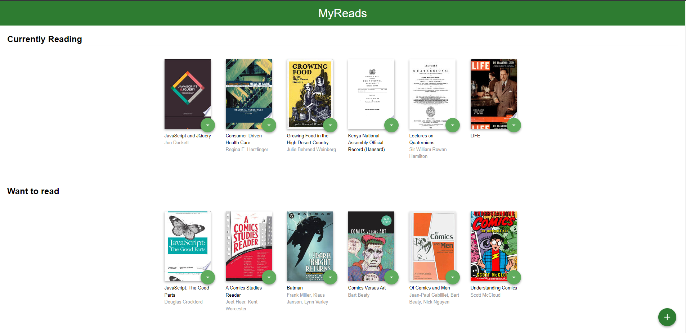

# MyReads Project

MyReads is a website that can help users to search a specific book and give a specific book a status. For example, You can search for a react book that you WANT TO READ or a Javascript book that you READ already. All you need to do is to click a button to change the status of the book. The project is based on a Udacity React cross-skilling Course project.

## TL;DR

To run the project all you need to do is:

- install all project dependencies with `npm install`
- start the development server with `npm start`


## Backend Server

To simplify your development process, we've provided a backend server for you to develop against. The provided file [`BooksAPI.js`](src/BooksAPI.js) contains the methods you will need to perform necessary operations on the backend:

- [`getAll`](#getall)
- [`update`](#update)
- [`search`](#search)

### `getAll`

Method Signature:

```js
getAll();
```

- Returns a Promise which resolves to a JSON object containing a collection of book objects.
- This collection represents the books currently in the bookshelves in your app.

### `update`

Method Signature:

```js
update(book, shelf);
```

- book: `<Object>` containing at minimum an `id` attribute
- shelf: `<String>` contains one of ["wantToRead", "currentlyReading", "read"]
- Returns a Promise which resolves to a JSON object containing the response data of the POST request

### `search`

Method Signature:

```js
search(query);
```

- query: `<String>`
- Returns a Promise which resolves to a JSON object containing a collection of a maximum of 20 book objects.
- These books do not know which shelf they are on. They are raw results only. You'll need to make sure that books have the correct state while on the search page.

## Important

The backend API uses a fixed set of cached search results and is limited to a particular set of search terms, which can be found in [SEARCH_TERMS.md](SEARCH_TERMS.md). That list of terms are the _only_ terms that will work with the backend, so don't be surprised if your searches for Basket Weaving or Bubble Wrap don't come back with any results.

## Features Added
Firstly, the main page contains the following features:
* There are three shelves shown in the page with the books given to each.
* The books viewed can be moved between shelves
* The books can also be deleted from all lists

Secondly, the search page contains the following features:
* The search contains a bar that listens to any change to its value.
* If the search is valid, then books will be viewed to the user.
* The user can add any book to the preferred status.
* The user can update already added books from the search page


## Screenshots


